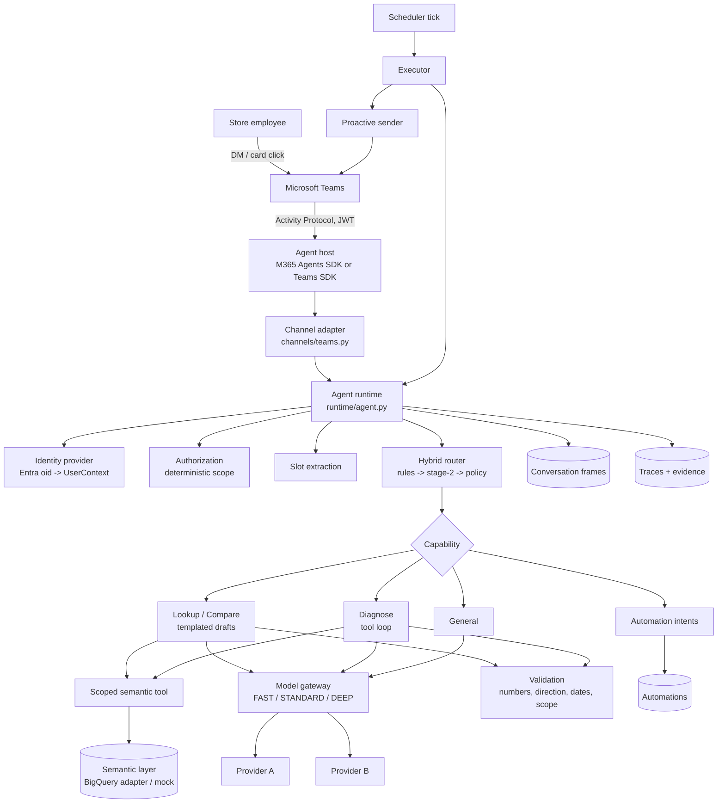
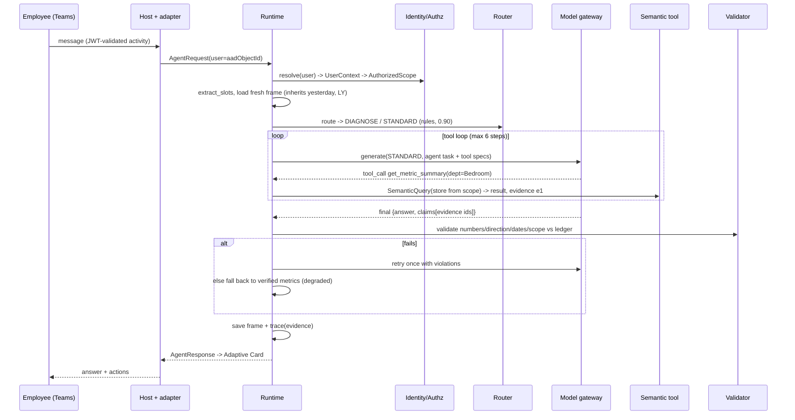

# Store Employee AI Agent: Architecture

Status: spike design, 2026-09-26. Covers the 14 deliverables in handoff §41. Code references
point at the runnable slice in `src/store_agent/`.

## 0. Assumptions and open questions

| # | Assumption used in this design | Owner / how to close |
|---|---|---|
| A1 | The "semantic layer" is likely a curated **BigQuery table** rather than a headless BI service. We therefore own a thin metric catalog (`config/semantic_catalog.yaml`) and a BigQuery adapter that compiles `SemanticQuery` to parameterized SQL. If Looker/dbt SL turns out to exist, only the adapter changes. | Confirm table(s), grain, freshness, and who owns metric definitions. |
| A2 | LY comparison = same weekday 364 days back. | Confirm against the fiscal calendar; replace `tools/semantic/calendar.py` with the calendar table. |
| A3 | Data lands daily; the latest complete day is "yesterday" in store-local time. "Today" questions are declined, not estimated. | Confirm load schedule / intraday feed. |
| A4 | No LLM provider is approved yet. Everything runs on a deterministic fake provider behind the gateway. | Pick providers per tier once enterprise approval and data-residency rules are known. |
| A5 | Store and role come from Entra/HR attributes (not from what the user types). | Identify the attribute source: Graph user profile, extension attributes, groups/app roles, or HR API. |
| A6 | Teams is the only channel for MVP; DM first, channel/group chat later. | Confirm with the M365 platform team, plus app approval process. |
| A7 | Jev is a candidate stage-2 router only; nothing depends on it. | Evaluate against `evals/` in Phase 2. |

## 1. System architecture



Principles carried from the handoff: authorization before any tool or model; the semantic
layer computes every number; models phrase, choose tools, and explain but never originate
figures; deterministic validation before anything reaches the employee; one orchestrator
with tools (no multi-agent layer); every vendor/tech choice behind an interface.

## 2. Component responsibilities and APIs

| Component | Module | Interface | Responsibility |
|---|---|---|---|
| Contracts | `contracts.py` | `AgentRequest`, `UserContext`, `RouteDecision`, `Slots`, `AgentResponse` | Channel-neutral request/response types |
| Identity | `security/identity.py` | `IdentityProvider.resolve(user_id) -> UserContext \| None` | Map Entra object id to store, role, market, tz, permissions. Fail closed. |
| Authorization | `security/authorization.py` | `resolve_scope(user) -> AuthorizedScope`, `require_store()` | Stores and capabilities the caller may use; model output can't widen it |
| Slot extraction | `router/slots.py` | `extract_slots(message, catalog) -> Slots` | Metrics, departments, time, comparison, dimensions, stores, schedule, anaphora |
| Router | `router/router.py`, `rules.py`, `intelligent.py` | `HybridRouter.route(message, slots, prior, allowed, trace) -> RouteDecision`; `IntelligentRouter.classify(...)` | Capability + reasoning tier + confidence policy |
| Conversation context | `context/conversation.py` | `ConversationStore.get_fresh/save`, `resolve_frame()` | Scoped follow-up memory (one frame per conversation, TTL) |
| Model gateway | `models/gateway.py` | `ModelGateway.generate(tier, ModelTask, trace) -> ModelResult`; `ModelProvider.complete(model, task, timeout)` | Tier -> model mapping, fallback, degrade, circuit breaker, cost |
| Semantic tool | `tools/semantic/*` | `SemanticLayer.query(SemanticQuery) -> SemanticResult`; `SemanticTool.query(q, purpose)` | Trusted metrics; scope enforcement; evidence + trace capture |
| Analysis tools | `tools/analysis.py` | `get_metric_summary`, `get_breakdown`, `get_availability` (JSON-schema tools) | What the reasoning model may call during diagnosis |
| Analytics | `analytics/contributions.py` | `with_contribution_shares(rows, metric)` | Deterministic contribution math |
| Runtime | `runtime/agent.py` | `AgentRuntime.handle(AgentRequest) -> AgentResponse`; `run_briefing(owner, store)` | Orchestration for interactive and scheduled paths |
| Drafts / briefing | `runtime/compose.py`, `briefing.py` | `lookup()`, `compare()`, `briefing()` -> `Draft` | Deterministic answers from results; FAST tier may rephrase |
| Diagnosis | `runtime/diagnose.py` | `run_diagnosis(...) -> (FinalAnswer, ValidationResult)` | Tool loop with validation-driven retry, fallback to verified metrics |
| Validation | `validation/numeric.py` | `validate_text(text, ledger, stores)`, `validate_claims()` | Numbers, direction, dates, comparison wording, store scope |
| Automations | `automations/*`, `runtime/automation_intents.py` | `AutomationRepository`, `PollingScheduler.tick()`, `AutomationExecutor.execute()` | Structured schedules, idempotent runs, retries, missed-run policy |
| Channels | `channels/*` | `ProactiveSender.send(user, response)`, `render_card()`, `activity_to_request()` | Teams mapping, Adaptive Cards, proactive delivery, console dev channel |
| Observability | `observability/tracing.py` | `Trace`, `TraceStore.save/get` | Per-request trace incl. evidence, model calls, validation |

## 3. Microsoft Teams integration approach

**Recommendation: host the bot with the Microsoft 365 Agents SDK (Python), behind our own
`channels/teams.py` mapping.** Microsoft now positions two supported SDKs (both Python):

- **Microsoft 365 Agents SDK:** Activity Protocol primitives that work across Teams, M365
  Copilot, Copilot Studio, and Web Chat. Microsoft's guidance: if a bot uses few Teams-native
  group features, this SDK is sufficient.
- **Teams SDK** (formerly Teams AI Library v2; Python GA May 2026, `microsoft-teams-apps`):
  deeper Teams-native features (mentions, threads, meetings, citations, Graph helpers).

Our MVP needs personal DMs, Adaptive Cards, and proactive messages, all of which both support. Reach
into Copilot/Web Chat later favors the Agents SDK. If channel/meeting participation becomes
central, switch the host to the Teams SDK; only the host shell changes because
`activity_to_request` / `response_to_activity` / `conversation_reference` are SDK-neutral.
Legacy Bot Framework SDK is not used.

Setup:

1. **Azure Bot resource** (single-tenant) with an Entra app registration or managed identity;
   Teams channel enabled. Messaging endpoint = our HTTPS service (`/api/messages`).
2. **Teams app manifest** with a bot in `personal` scope (add `team`/`groupChat` later),
   distributed via the org app catalog; admins can pre-install for store roles.
3. **Inbound auth:** the SDK validates the Bot Connector JWT. We trust only
   `from.aadObjectId` + `conversation.tenantId` from the validated activity, then resolve
   store/role from directory attributes (A5). Message text never grants identity.
4. **Proactive messages:** store a conversation reference on every inbound message and on
   the install `conversationUpdate`. For users who never opened the bot, proactively install
   the app for the user via Graph (`/users/{id}/teamwork/installedApps`), then create the
   1:1 conversation. `OutboxSender` models this: no reference, no delivery.
5. **Adaptive Cards 1.5** with `Action.Submit` `{msg: ...}`, which re-enters as a normal turn
   (`context.source = card_action`). Move to `Action.Execute` (Universal Actions) when we need
   in-place card refresh or feedback buttons.
6. **Throttling:** honor 429 / `Retry-After` in the sender; the executor already retries with
   backoff and records `delivery_failed`.
7. **Local dev:** Microsoft 365 Agents Playground plus a dev tunnel; the `store-agent chat` CLI
   covers everything behind the adapter.

SSO/on-behalf-of tokens are not needed for MVP because the service queries data with its own
identity under enforced store scope. Add OBO only if a downstream API requires user-delegated
access.

## 4. Storage requirements

| Store | Contents | Access pattern | Retention | Spike | Production |
|---|---|---|---|---|---|
| `automations` | Definition JSON + indexed `owner`, `status`, `next_run_at` | Due scan every tick; per-owner list | Until deleted + 90d | SQLite | Postgres (Cloud SQL / Azure PG) |
| `automation_runs` | PK `(automation_id, scheduled_for)`, status, error, request_id | Insert-or-ignore claim (idempotency) | 180d | SQLite | Postgres |
| `conversation_refs` | Teams conversation reference per user/channel | Read on proactive send | Life of install | SQLite | Postgres |
| `conversation_frames` | One analytic frame per conversation | Read/write each turn, TTL 30 min | 7d | SQLite | Postgres or Redis |
| `traces` | Route, tools, model calls, evidence, validation, status | Append; analytics | 13 months (YoY eval) | SQLite | BigQuery (+ OpenTelemetry) |
| `outbox` | Local stand-in for delivered proactive payloads | Dev only | n/a | SQLite | Not needed; Teams is the sink |
| Feedback (Phase 4) | request_id, rating, reason | Join to traces | 13 months | n/a | BigQuery |

Message text is off by default in traces (`log_message_text`); a hash and length are kept.
Evidence (tool outputs) is stored for audit; it is company data at the same sensitivity as
the semantic layer and must follow its access controls.

## 5. Router design and schema

Two outputs per request: **capability** and **reasoning tier**, plus confidence.

- **Stage 0: policy.** Stores named in the message outside `AuthorizedScope` produce `DENY`
  before routing, tools, or models.
- **Stage 1: rules** (`router/rules.py`). Ordered patterns over normalized text + slots:
  conditional alert, recurring delivery, setup without a schedule, manage automation,
  action, forecast, document, diagnose, compare, short follow-up (inherits the previous
  capability), briefing, lookup. Each rule sets a confidence; `deep_triggers` raise DIAGNOSE
  to DEEP.
- **Stage 2: `IntelligentRouter`** (`router/intelligent.py`), which classifies from the allowed
  capability list and the stage-1 hint. `ModelRouter` uses the gateway; Jev or any classifier
  implements the same protocol.
- **Policy** (`router/router.py`, thresholds in `config/routing.yaml`): `>= 0.85` execute;
  `0.60-0.85` re-classify at STANDARD and keep the stronger decision; `< 0.60` becomes GENERAL
  at STANDARD, where the primary model resolves intent. We never loop on clarifying questions.
- **Default tiers:** LOOKUP NONE, COMPARE FAST, DIAGNOSE STANDARD (DEEP on triggers),
  CREATE_AUTOMATION FAST, MANAGE_AUTOMATION NONE, GENERAL FAST.

```json
{
  "capability": "DIAGNOSE",
  "reasoning_tier": "STANDARD",
  "confidence": 0.9,
  "tools": [],
  "router": "rules",
  "reason": "why/explain phrase",
  "slots": {
    "metrics": [], "departments": ["Bedroom"], "time_range": null, "comparison": null,
    "dimensions": [], "store_ids": [], "anaphora": false,
    "recurrence": false, "schedule_days": null, "schedule_time": null
  }
}
```

**Follow-ups** (`context/conversation.py`). A turn is a follow-up when a fresh frame exists and the
message has anaphora or restates neither metric nor time. Metric and time are inherited
when missing. Comparison and departments are inherited only on follow-ups. Dimensions are
never inherited. Store is inherited only on follow-ups and is always re-authorized.

**Evaluation:** `evals/datasets/router_cases.jsonl` (43 labeled cases across the handoff's
categories, including multi-turn) and `evals/run_router_eval.py`. The runner reports
capability accuracy, tier accuracy, unnecessary-deep rate, incorrect-fast rate, stage-2
rate, router latency, and cost per request.

### Stage-2 System One model candidates

Research snapshot: **2026-09-28**, for B-12. These are possibilities for evaluation,
not selected providers or implemented integrations. "System One" here includes typed
decision models and small classifiers. Choice selects a category, Score evaluates ordered
options, and Noul answers a Boolean question; names and response formats vary by project.
Published latency and benchmark results are author-reported, not measurements on our workload.

**Commercial / hosted**

| Candidate | Potential fit | Status and integration notes |
|---|---|---|
| **1. Jev 1.13 — TypeSafe AI** | Reference candidate for Choice / Score / Noul, with RLCD-trained probabilities. | Launch announcement describes early access; confirm current availability and service terms rather than assume GA. Published pricing: $0.042 per million input tokens, output free; reported latency: 70–500 ms. OpenRouter lists `typesafe/jev-1.13` through its Decisions API. Sources: [TypeSafe launch](https://typesafe.ai/blog/introducing-system-one-models-and-jev), [hosted model](https://openrouter.ai/typesafe/jev-1.13). |
| **2. Tev1 — Together AI** | Experimental Qwen3.5-4B classifier; Choice with 2–24 options. Public training recipe offers a reproducible baseline. | Hosted ID: `together/Tev1-4B-experimental`. Uses a standard next-token head and chat completions returning an option letter; requires parsing and mapping. Log probabilities are not calibrated confidence. Confirm current endpoint pricing and availability; released weight terms are separate from MIT repository code. Sources: [Together recipe](https://www.together.ai/blog/how-to-train-your-own-jev), [model card](https://huggingface.co/togethercomputer/Tev1-4B-experimental), [repository](https://github.com/togethercomputer/tev1). |

**Open-weight / self-hosted candidates**

| Candidate | Potential fit | Status and integration notes |
|---|---|---|
| **3. Kev family — Jared Palmer** | 0.8B / 4B / 9B variants among a growing family; Choice / Score / Noul. Practical candidate for comparing local and hosted decisions. | Repository provides a TypeSafe-compatible `/v1/systemone` server and Apache 2.0 code. Pin the exact checkpoint and base-model terms. OpenRouter's Kev-4B listing reports $0.042 per million input tokens and free output through its Decisions API. Sources: [repository](https://github.com/jaredpalmer/kev), [hosted Kev-4B](https://openrouter.ai/jaredpalmer/kev-4b). |
| **4. Laya — Convai Innovations** | Approximately 322–421M encoder variants using ModernBERT / mmBERT and decision heads; Choice / Score / Noul. Candidate for lightweight local inference and multilingual routing. | Apache 2.0 stated by the project. Context limits differ by checkpoint: the English model card lists 512 tokens per question. Multilingual coverage and roughly 33–38 ms GPU latency are project claims to evaluate locally. Verify serving format rather than assume a base-URL-only swap. Sources: [model card](https://huggingface.co/convaiinnovations/laya), [project site](https://laya.convaiinnovations.com/). |
| **5. Decider series — Mapika** | Qwen3.5-based 2B / 4B candidates with all three primitives and a TypeSafe-compatible server. | Apache 2.0 repository. Pin a release: current release notes disclose that 4B v2.1 and 2B v11 did not pass the project's pre-registered release rules. Earlier benchmark wins do not establish consistent superiority over Jev. Source: [repository and release notes](https://github.com/Mapika/decider). |
| **6. CLM — Contrastive-LM / Jacky Kwok team** | CLM-8B scores state against candidate actions using contrastive embeddings; reusable action embeddings may help repeated routing schemas. | Apache 2.0 repository with training recipe and a TypeSafe-compatible serving layer. Reference setup uses Qwen3-8B plus a decision head. Default serving context is 2,048 tokens and can truncate inputs; verify both encoder and server limits. Source: [repository](https://github.com/Contrastive-LM/CLM). |
| **7. GLiNER2.5-Decide — Fastino Labs** | 340M DeBERTa-based encoder with typed classification, span/relation extraction, and cross-decision constraints. Candidate for CPU or small-GPU routing. | Apache 2.0 model card. Uses the GLiNER2 SDK; TypeSafe wire compatibility is not established. Published latency depends on hardware and short inputs. Evaluate classification alone before considering its additional extraction features. Sources: [model card](https://huggingface.co/fastino/GLiNER2.5-Decide), [release article](https://fastino.ai/blog/gliner-2-5-decide-open-weight-decision-model). |
| **8. Bespoke-Nimble — Bespoke Labs** | Qwen3.5-9B adapter with candidate scoring over enum / Boolean schemas; ordered enums can support application-computed scores. Public training recipe. | Native schema and serving format need an adapter; do not assume TypeSafe compatibility. Confirm code, adapter, and base-weight licenses individually. Calibration changes between checkpoints, so pin and evaluate the release. Sources: [repository](https://github.com/bespokelabsai/nimble), [model card](https://huggingface.co/bespokelabs/Bespoke-Nimble-9B). |
| **9. NanoJev — TianyuCodings; similar small experiments** | Qwen3-0.6B with decision heads for Choice / Boolean / Score. Useful research or resource-constrained baseline. | NanoJev's published checkpoint is trained on game tasks; retail intent transfer is unproven. Native endpoint is `/api/evaluate`, not `/v1/systemone`. MIT repository code does not settle base-model, weight, or dataset terms. Assess other small experiments individually. Sources: [repository](https://github.com/TianyuCodings/NanoJev), [checkpoint](https://huggingface.co/C-Tianyu/NanoJev). |

**Fit to this router.** An evaluated candidate needs an `IntelligentRouter` adapter returning
capability, reasoning tier, and confidence. Restrict capability choices to the supplied allowed
list; classify tier separately if needed. Keep authorization and slot extraction deterministic.
Typed outputs do not guarantee correct intent, and provider confidence fields are not necessarily
interchangeable. Validate and calibrate them before applying our 0.60 / 0.85 thresholds.

**B-12 comparison.** Start with the rules-only and existing `ModelRouter` baselines, then pilot
a small subset of this list on B-10's expanded dataset with held-out cases. Report capability
and tier accuracy, confidence calibration, fallback rate, p50/p95 latency, and cost, both on
stage-2 cases and across the complete hybrid router. Include ambiguous requests, follow-ups,
and context-limit cases. Record checkpoint, API version, hardware, concurrency, and warm/cold
conditions. Confirm licenses, data handling, and access before a pilot; self-hosted compute
has a cost even when weights are free. No candidate is a production choice until it passes
our own evaluation.

## 6. Model gateway interface

```python
gateway.generate(tier: Tier, task: ModelTask, trace: Trace | None) -> ModelResult

class ModelTask:      kind, messages, tools: list[ToolSpec], context, response_format
class ModelResult:    text | tool_calls, model, tier, latency_ms, input/output_tokens, cost_usd
class ModelProvider:  complete(model: str, task: ModelTask, timeout_s: float) -> ProviderResponse
```

- `config/models.yaml` maps `FAST/STANDARD/DEEP` to `provider/model` ids with `primary`,
  `fallback`, `degrade_to`, `timeout_s`, and per-model pricing.
- Chain for a tier = primary, fallback, then the `degrade_to` tier's chain (DEEP to STANDARD).
- A per-model circuit breaker (3 failures, 60 s cooldown) skips failing models.
- Every attempt is recorded (model, tier served, latency, tokens, cost, error).
- `Tier.NONE` never calls a model (a guard raises).
- Adding a real provider means one class implementing `ModelProvider` that maps `ModelTask`
  messages and tools to the vendor API. Selection by cost, latency, context window,
  residency, and approval status becomes config on each model entry; no agent code changes.
- Graceful degradation when every model is down: lookup/compare return the verified
  template; diagnosis returns verified raw metrics marked `degraded`; general returns a
  static help line.

## 7. Semantic-layer tool interface

```python
class SemanticQuery:   store_id, metrics, dimensions[department|hour|date], time_range,
                       comparison[last_year|prior_period], filters{department: [...]},
                       order_by, descending, limit
class SemanticResult:  query, period(start, end, label, comparison_*), rows, source
# row: {dims..., m, m_cmp, m_diff, m_pct}; m_pct is None for percent metrics (diff in pp)
class SemanticLayer:   query(q) -> SemanticResult   # raises DataNotAvailable / UnsupportedQuery / Unavailable
```

- `store_id` is set only by the runtime from `AuthorizedScope`. The diagnosis tools don't
  expose it, so neither a model nor injected text can redirect a query to another store.
- `SemanticTool` wraps every call: `require_store`, catalog vocabulary checks, trace
  record, and an evidence-ledger entry.
- Derived metrics (AOV = sales / transactions), comparisons, deltas, and percent changes
  are computed in the layer; contribution shares come from `analytics/`.
- **BigQuery adapter (next).** Compile to parameterized Standard SQL over the fact table,
  joined to the calendar table for period and LY alignment. Enforce store with a mandatory
  `WHERE store_id = @store_id` plus BigQuery row-level security or authorized views. Add
  per-query byte caps, a timeout, and a result cache keyed by normalized query + data
  version. Metric SQL lives beside `semantic_catalog.yaml`, never in prompts.

## 8. Automation data model

```json
{
  "automation_id": "a-3f9c1d2e",
  "owner": "<entra object id>",
  "type": "scheduled",
  "status": "active | paused | deleted",
  "schedule": {"days_of_week": [0,1,2,3,4], "time": "08:00"},
  "timezone": "America/New_York",
  "task": {"type": "DAILY_SALES_BRIEFING", "store_id": "042"},
  "delivery": {"channel": "teams_dm"},
  "condition": null,
  "created_at": "...", "updated_at": "...",
  "next_run_at": "2026-09-28T12:00:00+00:00",
  "last_run_at": null, "last_status": null, "last_error": null
}
```

- Schedules are structured day/time in the owner's timezone, so "move to 7:30" and "only
  weekdays" are field edits. `Schedule.cron()` exports `0 8 * * 1-5` for external
  schedulers. `next_run` is DST-safe.
- `condition` (metric, operator, threshold, frequency) is modelled now for conditional
  alerts. It is evaluated deterministically and never re-read by a model.
- Runs: `automation_runs` PK `(automation_id, scheduled_for)` makes execution idempotent
  across restarts and multiple workers. Run statuses: `delivered`, `delivery_failed`,
  `denied`, `error`, `missed`.
- Local recovery: each SQLite tick commits the schedule advance, run record, and local
  outbox writes in one transaction. An interruption rolls them back, leaving the run due
  for retry. Ticks are serialized; slow queries hold the SQLite write lock. Before adding
  an external Teams sender, use a durable delivery outbox: remote sends cannot roll back
  with SQLite, so this transaction alone cannot guarantee exactly-once remote delivery.
- Policy: the tick advances `next_run_at` within that transaction. Runs later than 2 h are
  recorded as `missed`, not sent. Owner identity and scope are re-resolved at run time.
  Denied or failed runs never deliver.
- Production scheduler: Cloud Scheduler (or an Azure Functions timer) calls a `tick`
  endpoint every minute; the logic stays in `PollingScheduler`. Move to Cloud Tasks or
  Temporal only if volume needs per-run queues.

## 9. Request lifecycle / sequence diagrams

**Interactive diagnosis ("Why was Bedroom down?")**



**Automation creation and scheduled delivery**

```mermaid
sequenceDiagram
    participant U as Employee
    participant R as Runtime
    participant A as Automation repo
    participant SC as Scheduler
    participant EX as Executor
    participant T as Teams (proactive)
    U->>R: "Send me this briefing every weekday at 8 AM"
    R->>R: route CREATE_AUTOMATION; slots days=Mon-Fri time=08:00
    R->>A: save(schedule, tz from UserContext, store from scope, next_run_at)
    R-->>U: "Done. First one arrives Mon Sep 28 at 8:00 AM EDT"
    SC->>A: due(now)
    SC->>A: advance next_run_at
    SC->>EX: execute(automation, scheduled_for)
    EX->>A: claim_run (insert-or-ignore)
    EX->>R: run_briefing(owner, store) [re-resolve identity + scope]
    R-->>EX: validated briefing (or denied/error: not sent)
    EX->>T: send via stored conversation reference (retry w/ backoff)
    EX->>A: finish_run + last_status
```

## 10. Security and authorization flow

1. **Authenticate:** the host validates the channel JWT, and the user id is the Entra object
   id from the activity.
2. **Resolve identity:** `IdentityProvider` maps the id to store, role, market, and timezone
   from the directory. Unknown principals are denied.
3. **Resolve scope:** `resolve_scope` = role policy (`config/capabilities.yaml`) gives the
   stores (home store or market) and the granted capabilities.
4. **Policy gate:** stores named in the text but outside scope are denied before routing.
5. **Capability gate:** a routed capability not granted to the role is denied, and a
   disabled capability returns its configured "not yet" message.
6. **Tool gate:** `SemanticTool` calls `require_store` on every query. Models cannot pass a
   store, and diagnosis tool arguments are schema-validated (invalid arguments return an
   error to the model, not an exception).
7. **Output gate:** validation rejects figures not in evidence and stores outside scope.
   General-knowledge answers may not contain store figures.
8. **Scheduled runs** re-run steps 2 and 3 at execution time, so revoked access stops delivery.

Additional rules: tool results are marked as data, not instructions, in prompts. Future
document retrieval must treat content as untrusted (injection), and actions need
confirmation, idempotency keys, and audit (not in MVP). Sensitive data may only reach
models whose gateway entry is approved for it; add a `data_classification` allow-list per
model when real providers arrive.

## 11. Observability design

Each request writes one `Trace` (`observability/tracing.py`) containing:
- **Request:** request_id, user, store, conversation, channel, timestamp, message hash and length.
- **Route:** capability, router (rules/model/policy), confidence, reason, tier, router latency.
- **Tools:** name, arguments, latency, status, error, evidence id.
- **Models:** purpose, tier served, actual model, latency, tokens, cost, errors/fallbacks.
- **Evidence:** the tool outputs behind the answer.
- **Outcome:** validation result, notes (fallbacks, retries), final status, response source, total latency.
- **Feedback:** 👍/👎 plus a reason, joined by request_id (Phase 4).

Production: emit traces as OpenTelemetry spans (runtime, router, each tool, each model call)
and land trace rows in BigQuery. A Looker dashboard can then show:
- route mix and stage-2 rate
- tier usage and unnecessary-deep rate
- validation-failure and fallback rates
- p50/p95 latency by capability
- cost per request, per store, and per day
- scheduler delivery success
- feedback by route and model

Alert on validation failure spikes, delivery failures, circuit-breaker opens, and
semantic-layer errors.

## 12. Repository structure

Python 3.12+, `uv`, a single package (`src/store_agent`), and one module per concern rather
than deep nesting. The handoff's service boundaries map one to one:

```text
config/        models.yaml  routing.yaml  capabilities.yaml  semantic_catalog.yaml  dev_users.yaml
src/store_agent/
  contracts.py  config.py  clock.py  formatting.py  storage.py  app.py (composition root)  cli.py
  security/     identity.py  authorization.py
  router/       slots.py  rules.py  intelligent.py  router.py
  models/       types.py  gateway.py  fake.py
  prompts/      classify_intent.md  narrate.md  diagnose.md  general.md
  context/      conversation.py
  tools/        semantic/{contract,calendar,mock,scoped}.py  analysis.py
  analytics/    contributions.py
  runtime/      agent.py  compose.py  briefing.py  diagnose.py  evidence.py  automation_intents.py
  validation/   numeric.py
  automations/  models.py  repository.py  scheduler.py
  channels/     base.py  adaptive_cards.py  teams.py  console.py
  observability/ tracing.py
evals/         datasets/router_cases.jsonl  run_router_eval.py
tests/         test_spike.py  test_authorization.py  test_validation.py  test_automations.py
               test_gateway_and_router.py  test_teams_mapping.py
docs/          ARCHITECTURE.md  BACKLOG.md
```

Services split out later only when they need independent scaling: the Teams host (web),
scheduler tick (job), and optionally the semantic adapter (if shared with other apps).

## 13. MVP backlog

See [BACKLOG.md](BACKLOG.md).

## 14. Vertical-slice prototype plan

| Spike requirement | Status in this repo | What makes it "real" |
|---|---|---|
| 1. "What were sales yesterday?" | Done: LOOKUP / NONE, templated, validated | BigQuery adapter (B-07) |
| 2. "Compare that with last year." | Done: follow-up inherits metric + date; FAST narration validated | Real FAST model (B-11) |
| 3. "Which departments drove the difference?" | Done: department deltas + totals | Same |
| 4. "Why was Bedroom down?" | Done: STANDARD tool loop, 3 tool calls, claims + validation, fallback | Real STANDARD model; tuning with golden set (B-11, B-13, B-25) |
| 5. "Send me this briefing every weekday at 8 AM." | Done: structured schedule, DST-safe, idempotent run, proactive DM via stored reference | Teams host + proactive send (B-16 to B-18), hosted tick (B-21) |
| Teams | Mapping + cards done, host not wired | B-16 to B-19 |
| Identity | Dev provider only | Entra attributes and roles (B-03, B-04) |
| Multiple tiers | NONE / FAST / STANDARD exercised, DEEP via triggers | Provider selection (A4) |

Run `uv run store-agent demo` to see the whole slice and `uv run pytest` (50 tests) to
verify it. The slice is "architecturally sound" per handoff §37 once B-03, B-07, B-11,
B-16 to B-18, and B-21 replace their fakes without changes outside adapters and config.
That is the acceptance test for this design.
